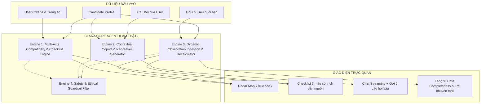

# CLARA Dating Compatibility Agent — Đề án Phân định Dữ liệu & Kiến trúc Core Agent

> **Tài liệu đặc tả kiến trúc:** Phân rạch ròi giữa **Data Mock**, **Data Thật**, và **Core Agent Chính làm thật** cho sản phẩm Dating Compatibility Copilot (Matching-Coach).
> 
> *Tham chiếu thiết kế:* [`../README.md`](../README.md) · [`../compatibility-copilot.html`](../compatibility-copilot.html) · [`../my-analyses.html`](../my-analyses.html) · [`../../../ideas/Matching-Coach.md`](../../../ideas/Matching-Coach.md)

---

## 🎯 1. Tôn Chỉ & Mục Tiêu Cốt Lõi

Trong việc phát triển sản phẩm AI Agent (đặc biệt trong các giai đoạn phát triển nhanh, Prototype hoặc Hackathon), việc xây dựng một hệ thống backend Dating App đầy đủ (User database khổng lồ, GPS realtime, Swipe engine, Messaging WebSocket) sẽ **tiêu tốn 80% thời gian nhưng không tạo ra giá trị khác biệt về mặt AI**.

Điểm đột phá độc bản của CLARA nằm ở:
> **AI-guided compatibility exploration**: Một không gian phân tích riêng tư, khách quan và minh bạch, giúp người dùng đối chiếu giá trị sống, khám phá sự phù hợp trước khi quyết định kết nối, và tự học hỏi hoàn thiện bản đồ tương thích sau mỗi buổi hẹn hò ngoài đời thực.

Do đó, đề án kiến trúc này phân định rõ:
1. **Data Mock (Giả lập):** Toàn bộ các thành phần thuộc về hạ tầng hẹn hò truyền thống để tinh giản scope.
2. **Data Thật (Real Data):** Dữ liệu thuộc về chính người dùng (tiêu chí, ranh giới, ghi chú quan sát thực tế).
3. **Core Agent Chính Làm Thật (LLM Inference & Agent Reasoning):** 100% năng lực phân tích đa trục, suy luận checklist có trích dẫn nguồn, sinh câu hỏi sâu và tái phân tích động từ ghi chú.

---

## 📊 2. Ma Trận Phân Định Tổng Thể

```
┌─────────────────────────────────────────────────────────────────────────────┐
│                            HỆ SINH THÁI CLARA                               │
├──────────────────────┬───────────────────────────┬──────────────────────────┤
│    1. DATA MOCK      │       2. DATA THẬT        │   3. CORE AGENT LÀM THẬT │
│ (Giả lập để tinh gọn)│ (Thu thập & lưu trữ thật) │ (LLM Inference & Logic)  │
├──────────────────────┼───────────────────────────┼──────────────────────────┤
│ • Danh sách 1000s user│ • Tiêu chí & Dealbreakers │ • Trừu tượng hóa 7 trục  │
│ • GPS/Khoảng cách    │ • Trọng số ưu tiên (%)    │ • Checklist 3 màu + căn cứ│
│ • Avatar chân dung   │ • Ghi chú sau buổi hẹn    │ • Trò chuyện Clara Coach │
│ • Push notifications │ • Query chat của User     │ • Tái đánh giá từ note   │
│ • Đồng bộ chat Zalo..│ • Trạng thái tiến trình   │ • Bộ lọc đạo đức & ranh giới│
└──────────────────────┴───────────────────────────┴──────────────────────────┘
```

### Bảng phân định theo từng màn hình mockup:

| Màn hình Mockup | Thành phần giao diện | Phân loại | Mô tả chi tiết & Căn cứ kỹ thuật |
| :--- | :--- | :---: | :--- |
| **Màn 1: Gợi ý hồ sơ**<br>([`index.html`](../index.html)) | Kho danh sách hàng ngàn ứng viên | **Data Mock** | Chuẩn bị sẵn **3–5 hồ sơ ứng viên mẫu** (Mai Linh, Tuấn Anh, Minh Châu) đại diện cho các mức độ tương thích và mức độ đầy đủ dữ liệu khác nhau. |
| | Ảnh chân dung, vị trí GPS, khoảng cách km | **Data Mock** | Ảnh chân dung AI generated / CSS gradient; khoảng cách cố định (không cần tích hợp dịch vụ định vị GPS). |
| | Bộ lọc tags (Mục tiêu, Lối sống, Ranh giới) | **Data Thật** | Đọc trực tiếp từ state bộ lọc mà người dùng đang click chọn trên giao diện. |
| | Câu nhận định nhanh AI trên từng thẻ profile | **Core Agent Làm Thật** | LLM chạy prompt đối chiếu nhanh 1 câu giữa tiêu chí User vs. Bio ứng viên (không hardcode). |
| **Màn 2: Không gian phân tích**<br>([`compatibility-copilot.html`](../compatibility-copilot.html)) | Bảng đối chiếu tiêu chí trực tiếp (Cột 1) | **Data Thật** | Lấy từ `User Criteria` đối chiếu với các thuộc tính của Candidate được chọn. |
| | Thước đo Độ đầy đủ dữ liệu (*Data Completeness %*) | **Core Agent Làm Thật** | Thuật toán đếm số lượng thuộc tính đã có dữ kiện thực tế so với tổng các thuộc tính trọng yếu. |
| | Chatbot Clara Dating Coach (Cột 2) | **Core Agent Làm Thật** | **LLM thật 100% (Streaming API):** Persona Clara ấm áp, khách quan, phân tích sâu, trả lời tự do theo câu hỏi của user. |
| | Gợi ý Icebreaker & 3 câu hỏi sâu probing | **Core Agent Làm Thật** | Agent tự động trích xuất các điểm giao thoa độc đáo (ví dụ: gốm Bát Tràng + UI/UX) để sinh câu mở đầu và câu hỏi probing. |
| | Bản đồ tương thích 7 trục (*Radar Chart*) | **Core Agent Làm Thật** | Agent tính toán và trả về mảng điểm số 7 trục (`0–100`) dạng JSON có cấu trúc; giao diện chỉ việc vẽ SVG. |
| | Checklist 3 tầng (Khớp, Cần xác nhận, Cân nhắc) | **Core Agent Làm Thật** | Agent phân loại và **bắt buộc trích dẫn nguồn căn cứ** (`source_evidence`: từ Bio, câu hỏi khảo sát nào). |
| | Nút "Match & Gửi lời nhắn" | **Data Mock** | Hiển thị Toast notification giả lập; không cần hệ sinh thái messaging thật. |
| **Màn 3: Hồ sơ đang tìm hiểu**<br>([`my-analyses.html`](../my-analyses.html)) | Nhật ký ghi nhận thực tế (*Self-logged observations*) | **Data Thật** | Textbox cho người dùng gõ văn bản tự do những điều mới biết được sau buổi hẹn ngoài đời. |
| | Tiến trình hẹn hò (*Đang nhắn tin / Đã gặp lần 1*) | **Data Thật** | Trạng thái do người dùng chủ động chọn và lưu vào Database/LocalStorage. |
| | Nút "Cập nhật lại phân tích" (*Dynamic Re-analysis*) | **Core Agent Làm Thật** | **Năng lực cốt lõi khác biệt:** Agent đọc ghi chú phi cấu trúc -> trích xuất facts -> lấp lỗ hổng thông tin -> tăng % Data completeness -> tính lại điểm Radar. |
| | Kế hoạch buổi hẹn sắp tới & Cảnh báo an toàn | **Core Agent Làm Thật** | Agent sinh gợi ý địa điểm và chủ đề dựa trên diễn biến mới nhất của các buổi hẹn. |
| **Màn 4: Tiêu chí & Ranh giới**<br>([`preferences-criteria.html`](../preferences-criteria.html)) | Deal-breakers (Không hút thuốc, kết hôn 2-3 năm..) | **Data Thật** | User toggle bật/tắt thật -> Lưu vào hồ sơ tiêu chí người dùng. |
| | Thanh trượt trọng số 7 trục (%) | **Data Thật** | Lưu giá trị số (`0–100%`) để làm tham số đầu vào cho công thức tính toán của Agent. |
| | Tùy chọn quyền riêng tư & Xóa sạch dữ liệu | **Data Thật** | Thực thi xóa state/session thật trong bộ nhớ khi người dùng bấm nút. |

---

## 🔍 3. Chi Tiết Nhóm 1: Những Gì NÊN LẤY TỪ DATA MOCK

Các thành phần này chỉ đóng vai trò làm bối cảnh nền cho Agent hoạt động, không cần tốn chi phí xây dựng thật:

1. **Candidate Pool (Kho ứng viên):**
   - Chỉ cần duy trì 3–5 hồ sơ JSON cố định nhưng giàu ngữ nghĩa:
     - `Candidate 1 - Mai Linh (26 tuổi, Product Designer)`: Tương thích cao (81%), khuyết thiếu thông tin tài chính cá nhân, có rủi ro về áp lực thời gian công việc startup.
     - `Candidate 2 - Tuấn Anh (29 tuổi, Bác sĩ nội trú)`: Tương thích khá (72%), lệch nhịp sinh hoạt ban ngày/ban đêm.
     - `Candidate 3 - Minh Châu (27 tuổi, Content Lead)`: Dữ liệu hồ sơ rất đầy đủ (82%), khác biệt về quan điểm định cư dài hạn.
2. **Hệ thống Chat P2P giữa hai người dùng ngoài đời:**
   - **Tôn chỉ sản phẩm:** CLARA cam kết không đọc lén, không nghe lén tin nhắn thật. Vì vậy, việc mock hoàn toàn hệ thống nhắn tin P2P vừa giúp tiết kiệm chi phí xây dựng WebSocket/chat server, vừa củng cố cam kết bảo mật với người dùng.
3. **Định vị GPS / Geo-distance:**
   - Sử dụng khoảng cách giả lập (ví dụ: "Cách bạn 3.2 km") thay vì tích hợp Google Maps API / Geolocation API.

---

## 🔐 4. Chi Tiết Nhóm 2: Những Gì BẮT BUỘC LÀ DATA THẬT

Dữ liệu này thuộc quyền sở hữu của người dùng, quyết định tính cá nhân hóa sâu sắc của Agent:

1. **User Values & Criteria (Hồ sơ tiêu chí cá nhân):**
   - Định hướng mối quan hệ (Nghiêm túc, kết hôn trong 2–3 năm, hay tìm hiểu chậm rãi).
   - Danh sách điều không thể thỏa hiệp (*Deal-breakers*): `no_smoking`, `pet_friendly`, `marriage_oriented`.
   - Trọng số ưu tiên trên 7 trục radar: `weights: { long_term_goals: 0.9, core_values: 0.85, ... }`.
2. **User-Logged Observations (Ghi chú tự quan sát ngoài đời thực):**
   - Dữ liệu dạng text tự do do người dùng ghi nhận sau mỗi lần trò chuyện hoặc hẹn gặp:
     > *"Buổi cafe hôm nay rất vui, Linh chia sẻ là cô ấy dự định sống lâu dài tại TP.HCM, không muốn đi nước ngoài, và muốn kết hôn sau khoảng 2 năm nữa..."*
3. **User Chat Queries (Câu hỏi tương tác với Agent):**
   - Bất kỳ băn khoăn nào của người dùng trong phiên chat riêng tư với Clara Copilot.
4. **Trạng thái tiến trình (Exploration State):**
   - Danh sách đối tượng đang theo dõi, mốc thời gian ghi chú, trạng thái hẹn hò (*Đang nhắn tin*, *Đã hẹn cafe*, *Đã ngừng tìm hiểu*).

---

## 🧠 5. Chi Tiết Nhóm 3: TRÁI TIM CORE AGENT CHÍNH PHẢI LÀM THẬT

Đây là **4 Engine cốt lõi** mang lại giá trị công nghệ cao nhất của hệ thống:



### Engine 1: Multi-Axis Compatibility & Structured Checklist Reasoning
- **Input:** `User Criteria` + `Candidate Profile JSON`.
- **Nhiệm vụ:**
  - Chấm điểm 7 trục dựa trên semantic match và mức độ đáp ứng tiêu chí.
  - Phân loại checklist thành 3 nhóm rõ rệt:
    - 🟢 **Phù hợp & Đồng điệu** (*Matched*)
    - 🟡 **Cần xác nhận thêm** (*Needs Check - do thiếu dữ liệu hoặc thông tin mơ hồ*)
    - 🔴 **Điểm khác biệt cần cân nhắc** (*Potential Friction / Deal-breaker alert*)
  - **Quy tắc bắt buộc:** Mỗi mục trong checklist **phải có trường `source_evidence`** ghi rõ căn cứ từ đâu (từ bio, câu hỏi số mấy, hay từ ghi chú).

### Engine 2: Contextual Dating Copilot (Clara Coach)
- **Input:** Toàn bộ ngữ cảnh của 2 hồ sơ + tin nhắn của User.
- **Nhiệm vụ:**
  - Streaming hội thoại với phong thái của Clara: ấm áp, khách quan, sâu sắc, không phán xét.
  - **Tự động sinh Icebreakers:** Tìm kiếm 1–2 giao điểm thú vị và tự nhiên nhất để gợi ý câu mở đầu.
  - **Tự động sinh 3 Probing Questions:** Soạn sẵn 3 câu hỏi tinh tế để user hỏi đối phương trong các buổi hẹn đầu nhằm kiểm chứng những điểm đang nằm trong nhóm "Cần xác nhận thêm".

### Engine 3: Observation Ingestion & Dynamic Re-analysis (Cập nhật từ ghi chú)
- **Input:** Bản đồ phân tích hiện tại + Đoạn ghi chú mới của User sau buổi gặp.
- **Nhiệm vụ:**
  - Trích xuất thông tin mới (*Information Extraction*).
  - Ánh xạ thông tin vào các trục tương ứng (ví dụ: phát hiện định hướng kết hôn -> giải tỏa nghi vấn về Kế hoạch tương lai).
  - Chuyển trạng thái checklist từ *Cần xác nhận* sang *Phù hợp* hoặc *Cân nhắc*.
  - Tính toán tăng chỉ số **Data Completeness %** một cách toán học/logic (ví dụ từ 74% lên 88%).
  - Cập nhật lại điểm 7 trục để giao diện tự động vẽ lại Radar chart.

### Engine 4: Safety & Ethical Guardrails
- Đảm bảo AI **không chấm điểm phẩm giá một con người** mà chỉ đánh giá mức độ tương thích với một bộ tiêu chí cụ thể.
- Đưa ra lời khuyên an toàn: không chia sẻ thông tin tài chính quá sớm, ưu tiên gặp mặt ban ngày ở nơi công cộng.

---

## 📑 6. Hợp Đồng Dữ Liệu Chuẩn (API / LLM Schemas)

### Request Schema gửi tới Core Agent:
```json
{
  "user_profile": {
    "name": "Hải Nam",
    "age": 28,
    "intent": "Nghiêm túc, kết hôn trong 2-3 năm",
    "deal_breakers": ["Không hút thuốc lá", "Yêu động vật"],
    "lifestyle": "Dậy sớm, chạy bộ, cafe sáng, coi trọng sự nghiệp",
    "weights": {
      "long_term_goals": 0.9,
      "core_values": 0.85,
      "communication": 0.8,
      "lifestyle_habits": 0.7,
      "interests": 0.6,
      "finances": 0.75,
      "future_plans": 0.85
    }
  },
  "candidate_profile": {
    "id": "cand_01",
    "name": "Mai Linh",
    "age": 26,
    "job": "Product Designer",
    "bio": "Thích làm gốm Bát Tràng cuối tuần, yêu mèo. Đang chạy nước rút cho một dự án startup công nghệ. Thích lối sống tối giản.",
    "questionnaire": {
      "relationship_goal": "Tìm hiểu lâu dài, cùng nhau phát triển",
      "smoking": "Không hút thuốc",
      "pets": "Rất thích chó mèo",
      "weekend_habit": "Workshop làm gốm, cafe sách, thiết kế",
      "future_plan": null,
      "financial_view": null
    }
  }
}
```

### Response Schema (Structured Output từ LLM):
```json
{
  "overall_compatibility": 81,
  "data_completeness": 74,
  "confidence_level": "Tin cậy khá (dựa trên 24 câu hỏi & Bio, thiếu dữ liệu tài chính)",
  "radar_axes": [
    { "label": "Mục tiêu lâu dài", "value": 85 },
    { "label": "Giá trị sống", "value": 90 },
    { "label": "Giao tiếp", "value": 80 },
    { "label": "Lối sống & Thói quen", "value": 85 },
    { "label": "Sở thích & Giải trí", "value": 75 },
    { "label": "Tài chính & Thực tế", "value": 65 },
    { "label": "Kế hoạch tương lai", "value": 70 }
  ],
  "checklist": {
    "matched": [
      {
        "title": "Lối sống lành mạnh & Không thuốc lá",
        "detail": "Cả hai đều không hút thuốc lá và có thói quen sinh hoạt ban ngày.",
        "source_evidence": "Câu hỏi trắc nghiệm hồ sơ"
      },
      {
        "title": "Ranh giới & Không gian cá nhân",
        "detail": "Đều coi trọng việc theo đuổi đam mê nghề nghiệp độc lập.",
        "source_evidence": "Phân tích Bio & Định hướng nghề nghiệp"
      }
    ],
    "needs_check": [
      {
        "title": "Kế hoạch thời gian kết hôn",
        "detail": "Bạn muốn hướng tới kết hôn trong 2-3 năm; Linh chưa nêu mốc thời gian cụ thể.",
        "source_evidence": "Mục Kế hoạch tương lai đang để trống"
      }
    ],
    "potential_friction": [
      {
        "title": "Áp lực thời gian từ Startup",
        "detail": "Linh đang giai đoạn tăng tốc startup, có thể bận vào cuối tuần.",
        "source_evidence": "Bio: 'Đang chạy nước rút cho startup'"
      }
    ]
  },
  "icebreakers": [
    "Chào Linh, anh thấy em nhắc tới gốm Bát Tràng trong bio. Em hay đi workshop vào cuối tuần à, có địa chỉ nào thú vị không gợi ý anh với?",
    "Thấy em làm Product Design, phong cách thiết kế tối giản hay playful hợp vibe em hơn?"
  ],
  "probing_questions": [
    "Khi công việc dồn dập, em thường xả stress bằng cách nào: muốn ở một mình hay trò chuyện với ai đó?",
    "Em dự định phát triển sự nghiệp tại TP.HCM lâu dài hay có ý định đi xa?"
  ]
}
```

---

## 🚀 7. Kế Hoạch Đấu Nối Vào Giao Diện Hiện Tại

Giao diện HTML/CSS/JS hiện tại trong thư mục [`matching-coach`](../) đã được thiết kế sẵn sàng để tích hợp:

1. **Giữ nguyên 100% Giao diện & CSS:** File [`styles.css`](../styles.css) và các cấu trúc DOM trong 4 tệp HTML đã chuẩn hóa hoàn toàn.
2. **Thay thế Simulator trong [`app.js`](../app.js):**
   - Thay hàm giả lập `setupChatSimulator` bằng `fetch('/api/clara/chat', { method: 'POST', body: JSON.stringify({ query }) })`.
   - Thay hàm giả lập `setupObservationLogger` bằng cuộc gọi API `/api/clara/reanalyze`.
   - Khi API trả về JSON cấu trúc mới, truyền mảng `response.radar_axes` vào hàm [`renderRadarChart`](../app.js#L12) để tự động render biểu đồ mới.
